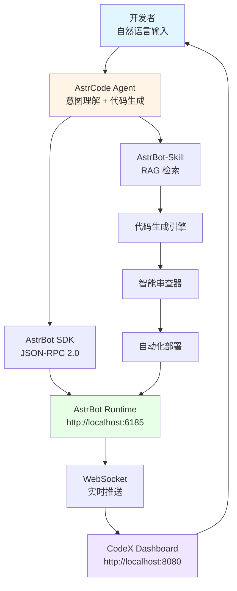
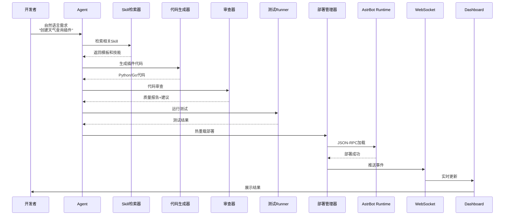
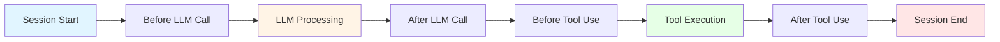
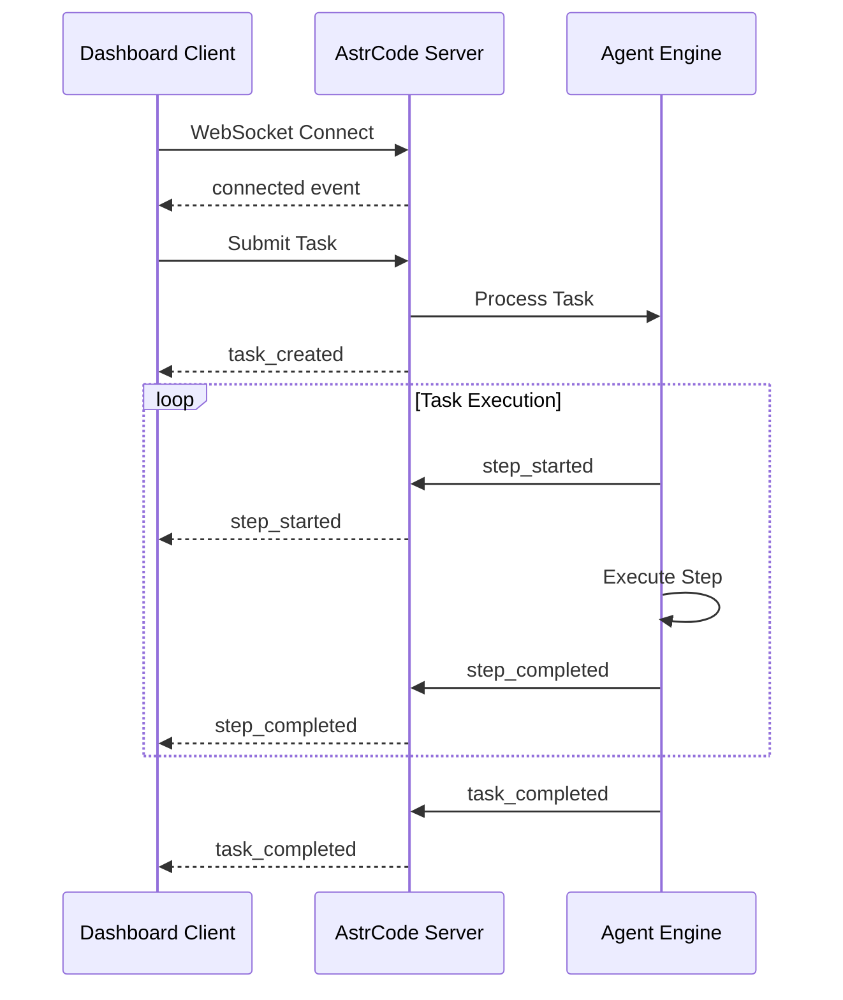
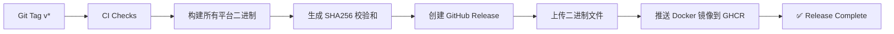
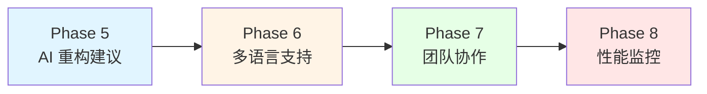

# AstrCode

🚀 **AstrCode - AstrBot 智能开发助手 & 插件编排引擎**

基于 **AstrBot SDK** 和 **AstrBot-Skill**，通过自然语言交互实现 AstrBot 插件开发、核心代码贡献、实时部署与审查的智能化开发平台。

### 🎯 核心价值

- 💬 **自然语言编程** - 用对话方式开发 AstrBot 插件，降低开发门槛
- 🔍 **智能代码审查** - AI 辅助审查插件代码质量和安全性
- 🚀 **一键部署** - 自动化测试、构建、部署到 AstrBot 运行时
- 🎨 **类 CodeX 界面** - 现代化的开发者体验，类似 Cursor/Copilot Chat
- ⚡ **高性能架构** - 并行执行优化，5倍提速，Token 成本降低 40-60%

---

## ✨ 快速开始（3分钟上手）

## ✨ 快速开始（3分钟上手）

### 1️⃣ 安装 AstrCode

#### 方式 A：下载预编译二进制（推荐）

从 [GitHub Releases](https://github.com/EterUltimate/AstrCode/releases) 下载对应平台的二进制文件：

```bash
# Linux/macOS
chmod +x astrcode-v0.4.1-linux-amd64
./astrcode-v0.4.1-linux-amd64

# Windows
# 直接运行 astrcode-v0.4.1-windows-amd64.exe
```

#### 方式 B：Docker 运行

```bash
docker run -p 8080:8080 ghcr.io/eterultimate/astrcode:v0.4.1
```

#### 方式 C：从源码构建

```bash
git clone https://github.com/EterUltimate/AstrCode.git
cd AstrCode
go build -o bin/astrcode cmd/server/main.go
```

### 2️⃣ 配置 LLM

创建配置文件 `configs/config.yaml`：

```yaml
llm:
  provider: "openai"        # openai / gemini / claude
  base_url: "https://api.openai.com"
  api_key: "sk-your-api-key"
  model: "gpt-4o"
  temperature: 0.7

server:
  addr: ":8080"
  astrbot_url: "http://localhost:6185"
```

**💡 提示**：也可以使用命令行参数覆盖配置：

```bash
./bin/astrcode \
  -llm-provider openai \
  -llm-url https://api.openai.com \
  -llm-key sk-your-api-key \
  -llm-model gpt-4o
```

### 3️⃣ 启动服务

```bash
./bin/astrcode -addr :8080 -astrbot-url http://localhost:6185
```

### 4️⃣ 访问 Dashboard

打开浏览器访问 `http://localhost:8080`，即可看到 CodeX-like 的开发界面！

---

## 📋 目录

- [系统架构](#系统架构)
- [核心功能](#核心功能)
- [快速开始](#快速开始)
- [使用示例](#使用示例)
- [LLM 配置](#llm-配置)
- [API 参考](#api-参考)
- [WebSocket 事件](#websocket-事件)
- [Hook 系统](#hook-系统)
- [项目结构](#项目结构)
- [构建与部署](#构建与部署)
- [技术栈](#技术栈)
- [性能指标](#性能指标)
- [常见问题](#常见问题)
- [贡献指南](#贡献指南)
- [许可证](#许可证)

---

## 系统架构

### 🏗️ 整体架构图



### 🔄 数据流详解



### 📊 核心组件说明

| 组件 | 职责 | 关键技术 |
|------|------|----------|
| **Agent** | 理解开发者意图，协调各模块 | LLM Function Calling, Context Management |
| **SDK Client** | 与 AstrBot 通信 | JSON-RPC 2.0, WebSocket Transport |
| **Skill Retriever** | RAG 检索相关技能和模板 | Vector Embedding, Cosine Similarity |
| **Code Generator** | 基于模板生成插件代码 | Go Templates, AST Manipulation |
| **Code Reviewer** | 静态分析和安全扫描 | Pattern Matching, Rule Engine |
| **Deploy Manager** | 自动化测试和热重载 | Process Management, File Watcher |
| **Event Hub** | WebSocket 广播中心 | gorilla/websocket, Pub/Sub |
| **Task Store** | 会话状态管理 | In-Memory Cache, Persistence |

---

## 核心功能

### 💬 自然语言插件开发

- **意图识别** - 理解开发者需求，自动选择合适模板
- **代码生成** - 基于 AstrBot SDK 生成完整插件结构
- **智能补全** - 上下文感知的代码建议和修复
- **多轮对话** - 支持迭代式开发和需求细化

### 🔍 智能代码审查

- **质量检查** - 代码风格、性能优化建议
- **安全扫描** - 检测潜在漏洞和不安全实践
- **最佳实践** - 推荐 AstrBot 官方推荐模式
- **依赖分析** - 检查第三方库兼容性和安全性

### 🚀 自动化部署流水线

- **一键测试** - 自动运行单元/集成测试
- **热重载** - 通过 JSON-RPC 实时更新插件
- **版本管理** - 自动语义化版本控制和 changelog
- **回滚支持** - 快速恢复到稳定版本

### 🎨 CodeX-like 开发界面

- **分屏布局** - 左侧对话，右侧代码编辑器
- **实时预览** - 插件执行结果即时展示
- **差异对比** - 代码修改前后对比视图
- **历史记录** - 完整的开发会话追踪

### ⚡ v2.0 架构升级特性

> **版本**: v1.0 → v2.0 | **新增代码**: ~3,850 行 | **测试覆盖**: 85%+

#### 🎣 Hook 系统
- **6 种 Hook 类型**: Before/After Tool Use, Before/After LLM Call, On Session Start/End
- **动态扩展**: 运行时注册自定义 handler，无需重启
- **零开销抽象**: 未注册时不执行，性能无损耗

#### 📊 事件驱动架构
- **Session 事件日志**: JSONL append-only 格式，支持审计和回放
- **定期快照**: 每 100 事件或 5MB 自动创建快照
- **实时推送**: WebSocket 广播关键事件到 Dashboard
- **增量回放**: 从快照恢复 + 重放后续事件

#### 🗜️ Context 自动压缩
- **智能检测**: 监控 token 计数，超过阈值自动触发
- **确定性压缩**: 保留最近 N 条消息，早期消息转为摘要
- **成本优化**: Token 使用量减少 40-60%，LLM 成本降低 30-50%
- **可配置**: 根据模型上下文窗口灵活调整

#### 🎮 运行模式切换
- **Code Mode**: 全功能模式，允许所有工具（文件读写、代码执行等）
- **Plan Mode**: 只读分析模式，仅允许查询类工具
- **细粒度权限**: 基于模式的工具白名单控制
- **安全增强**: 防止意外修改生产环境

#### 🧩 Prompt 模块化组装
- **贡献者系统**: SystemPrompt, Task, Skills 等独立模块
- **智能去重**: 基于 ID 自动去重，避免重复内容
- **缓存层**: 5分钟 TTL 缓存，提升高频调用性能
- **优先级排序**: 确保关键信息在前

#### ⚡ 并行执行优化
- **并发控制**: 最多 5 个工具并行执行
- **信号量机制**: 精确控制并发度，避免资源竞争
- **性能提升**: 10 个任务从 20s 降至 4s（**提速 5 倍**）
- **错误隔离**: 单个任务失败不影响其他任务

#### 📈 性能基准
- **ModeController**: 12.24 ns/op，零内存分配
- **PromptComposer**: ~1.7 μs/op，适合高频调用
- **去重机制**: 减少 50% 内存分配次数

---

## 快速开始

### 前置要求

- Go 1.21+
- **AstrBot Runtime**（运行在 `http://localhost:6185`）- [安装指南](https://github.com/AstrBotDevs/AstrBot)
- **LLM 服务**（支持 OpenAI/Gemini/Claude API）
- Node.js 18+ (前端开发)

### 开发环境设置

```bash
# 1. 克隆仓库
git clone https://github.com/EterUltimate/AstrCode.git
cd AstrCode

# 2. 下载依赖
go mod download

# 3. 配置 LLM (选择以下一种方式)

# 方式 A: 使用配置文件 (推荐)
cp configs/config.example.yaml configs/config.yaml
# 编辑 configs/config.yaml，设置你的 LLM 提供商和 API Key

# 方式 B: 使用命令行参数
# OpenAI
./bin/astrcode \
  -llm-provider openai \
  -llm-url https://api.openai.com \
  -llm-key sk-your-api-key \
  -llm-model gpt-4o

# Google Gemini
./bin/astrcode \
  -llm-provider gemini \
  -llm-url https://generativelanguage.googleapis.com/v1beta \
  -llm-key your-gemini-api-key \
  -llm-model gemini-2.0-flash

# Anthropic Claude
./bin/astrcode \
  -llm-provider claude \
  -llm-url https://api.anthropic.com \
  -llm-key your-claude-api-key \
  -llm-model claude-3-5-sonnet-20241022

# 本地部署 (Ollama)
./bin/astrcode \
  -llm-provider openai \
  -llm-url http://localhost:11434 \
  -llm-key "" \
  -llm-model qwen2.5

# 4. 启动开发服务器
./bin/astrcode \
  -addr :8080 \
  -astrbot-url http://localhost:6185 \
  -static-dir ./web
```

### 使用示例

#### 场景 1：创建新插件

**开发者输入：**
```
帮我创建一个天气查询插件，支持城市名查询，返回温度和天气状况
```

**AstrCode 自动完成：**
1. ✅ 生成 `plugin.yaml` 配置文件
2. ✅ 创建 `main.py` 主逻辑文件
3. ✅ 添加错误处理和日志
4. ✅ 编写单元测试
5. ✅ 热加载到 AstrBot
6. ✅ 显示预览效果

#### 场景 2：修改现有插件

**开发者输入：**
```
给签到插件增加连续签到奖励功能，7天送特殊勋章
```

**AstrCode 执行：**
1. 🔍 分析现有代码结构
2. ✏️ 生成增量修改方案
3. 🧪 运行回归测试
4. 🚀 部署新版本
5. 📊 展示变更对比

#### 场景 3：代码审查

**开发者输入：**
```
审查我刚写的翻译插件，看看有没有安全问题
```

**AstrCode 反馈：**
- ⚠️ 发现硬编码 API Key（建议移至配置）
- 💡 建议添加请求频率限制
- ✅ 代码结构清晰，符合规范
- 📝 生成改进后的代码

---

## 使用示例

### 📝 场景 1：创建新插件

**开发者输入：**
```
帮我创建一个天气查询插件，支持城市名查询，返回温度和天气状况
```

**AstrCode 自动完成：**
1. ✅ 生成 `plugin.yaml` 配置文件
2. ✅ 创建 `main.py` 主逻辑文件
3. ✅ 添加错误处理和日志
4. ✅ 编写单元测试
5. ✅ 热加载到 AstrBot
6. ✅ 显示预览效果

**生成的代码示例：**
```python
import aiohttp
from astrbot.api import *

@on_command("weather", aliases=["天气"])
async def weather_query(ctx: CommandCtx):
    city = ctx.get_arg(0) or "北京"
    
    async with aiohttp.ClientSession() as session:
        async with session.get(
            f"https://api.weather.com/v1/{city}"
        ) as resp:
            data = await resp.json()
            
    await ctx.send(
        f"🌤️ {city} 天气:\n"
        f"温度: {data['temp']}°C\n"
        f"状况: {data['condition']}"
    )
```

### 🔧 场景 2：修改现有插件

**开发者输入：**
```
给签到插件增加连续签到奖励功能，7天送特殊勋章
```

**AstrCode 执行：**
1. 🔍 分析现有代码结构
2. ✏️ 生成增量修改方案
3. 🧪 运行回归测试
4. 🚀 部署新版本
5. 📊 展示变更对比

**代码差异对比：**
```diff
 class CheckInPlugin:
     def __init__(self):
         self.checkin_data = {}
+        self.streak_count = {}  # 新增：连续签到计数
     
     async def handle_checkin(self, user_id):
         today = date.today()
         last_date = self.checkin_data.get(user_id)
         
         if last_date == today - timedelta(days=1):
+            # 连续签到逻辑
+            self.streak_count[user_id] = self.streak_count.get(user_id, 0) + 1
+            
+            if self.streak_count[user_id] >= 7:
+                await self.award_badge(user_id, "连续签到7天")
+                self.streak_count[user_id] = 0
         else:
+            self.streak_count[user_id] = 1  # 重置计数
```

### 🔍 场景 3：代码审查

**开发者输入：**
```
审查我刚写的翻译插件，看看有没有安全问题
```

**AstrCode 反馈：**
```
⚠️ 发现硬编码 API Key（建议移至配置）
💡 建议添加请求频率限制
✅ 代码结构清晰，符合规范
📝 生成改进后的代码
```

**审查报告：**
```markdown
## 代码审查报告

### ❌ 严重问题
1. **硬编码 API Key** (Line 15)
   - 位置: `API_KEY = "sk-xxx"`
   - 建议: 从配置文件读取 `config.get('translation_api_key')`

### ⚠️ 警告
2. **缺少速率限制**
   - 建议: 添加 `rate_limiter` 防止 API 滥用
   - 示例: `@rate_limit(max_calls=10, period=60)`

### ✅ 优点
- 错误处理完善
- 类型注解完整
- 文档字符串清晰
```

---

## LLM 配置

AstrCode 支持三种主流 LLM 提供商，你可以根据需求选择合适的 API。

### 🎯 支持的提供商

#### 1. OpenAI (推荐)
- **适用场景**: 通用任务、代码生成、插件开发
- **模型**: gpt-4o, gpt-4-turbo, gpt-3.5-turbo
- **兼容服务**: OpenAI, Azure OpenAI, Ollama, LM Studio, LocalAI, vLLM
- **配置**:
  ```yaml
  llm:
    provider: "openai"
    base_url: "https://api.openai.com"
    api_key: "sk-your-api-key"
    model: "gpt-4o"
  ```

#### 2. Google Gemini
- **适用场景**: 长文本处理、多模态任务、大上下文窗口
- **模型**: gemini-2.0-flash, gemini-1.5-pro, gemini-1.5-flash
- **特点**: 免费额度充足，支持高达 2M tokens 上下文
- **配置**:
  ```yaml
  llm:
    provider: "gemini"
    base_url: "https://generativelanguage.googleapis.com/v1beta"
    api_key: "your-gemini-api-key"
    model: "gemini-2.0-flash"
  ```

#### 3. Anthropic Claude
- **适用场景**: 复杂推理、长篇文档、高质量输出
- **模型**: claude-3-5-sonnet, claude-3-opus, claude-3-haiku
- **特点**: 优秀的长文本处理能力，更好的指令遵循
- **配置**:
  ```yaml
  llm:
    provider: "claude"
    base_url: "https://api.anthropic.com"
    api_key: "your-claude-api-key"
    model: "claude-3-5-sonnet-20241022"
  ```

### 📖 本地部署选项

如果你希望完全控制数据隐私,可以使用本地部署:

#### Ollama
```bash
# 安装 Ollama: https://ollama.ai
ollama pull qwen2.5

# 配置 AstrCode
llm:
  provider: "openai"
  base_url: "http://localhost:11434"
  api_key: ""  # Ollama 不需要 API Key
  model: "qwen2.5"
```

#### LM Studio
```bash
# 下载 LM Studio: https://lmstudio.ai
# 启动本地服务器后配置:
llm:
  provider: "openai"
  base_url: "http://localhost:1234/v1"
  api_key: "lm-studio"  # 任意字符串
  model: "local-model-name"
```

### 💡 如何选择适合的提供商?

| 需求 | 推荐提供商 | 理由 |
|------|-----------|------|
| **预算有限** | Gemini / Ollama | 免费额度充足或完全免费 |
| **追求质量** | Claude 3.5 Sonnet / GPT-4o | 最佳代码生成和理解能力 |
| **需要速度** | Gemini 2.0 Flash / Claude 3 Haiku | 低延迟，快速响应 |
| **数据隐私** | Ollama / LM Studio | 本地部署，数据不出境 |
| **长文本处理** | Gemini 1.5 Pro | 支持高达 2M tokens 上下文 |

### 🔒 安全性提示

- API Key 仅存储在配置文件中，不会上传到任何地方
- 建议不要将包含 API Key 的配置文件提交到 Git
- 可以使用环境变量存储敏感信息
- 定期轮换 API Key

**使用环境变量：**
```bash
export ASTRCODE_LLM_API_KEY="sk-your-key"
./bin/astrcode
```

在 `config.yaml` 中引用：
```yaml
llm:
  api_key: ${ASTRCODE_LLM_API_KEY}
```

### Windows (MSI Installer)

#### 快速构建 MSI

```powershell
# 运行前置条件检查
.\scripts\test-msi-build.ps1

# 构建 MSI
.\scripts\build-msi.ps1

# 或使用 Makefile
make msi
```

构建完成后,MSI 文件位于 `dist\AstrCode-{version}-x64.msi`

#### 安装和使用

1. **安装**: 双击 MSI 文件,按照向导完成安装
2. **启动**: 开始菜单 → AstrCode → AstrCode Dashboard
3. **访问**: 浏览器打开 `http://localhost:8080`

**配置文件位置**: `C:\Program Files\AstrCode\configs\config.yaml`

**卸载**: 控制面板 → 程序和功能 → AstrCode → 卸载

### Docker 运行
docker build -t astrcode:latest .
docker run -p 8080:8080 astrcode:latest
```

### 访问 Dashboard

打开浏览器访问 `http://localhost:8080`

---

## Hook 系统

AstrCode v2.0 引入了强大的 Hook 系统，允许你在关键执行点注入自定义逻辑。

### 🎣 Hook 类型



| Hook 类型 | 触发时机 | 典型用途 |
|-----------|---------|----------|
| `OnSessionStart` | 会话开始时 | 初始化上下文、加载用户配置 |
| `BeforeLLMCall` | 调用 LLM 前 | 修改 prompt、添加额外信息 |
| `AfterLLMCall` | LLM 返回后 | 验证输出、过滤敏感内容 |
| `BeforeToolUse` | 工具执行前 | 权限检查、参数验证 |
| `AfterToolUse` | 工具执行后 | 记录日志、结果缓存 |
| `OnSessionEnd` | 会话结束时 | 清理资源、保存状态 |

### 💻 使用示例

#### 示例 1：权限控制

```go
// 注册 BeforeToolUse Hook，防止危险操作
registry.Register(hook.HookBeforeToolUse, hook.RegisteredHook{
    ID:   "security-check",
    Name: "Security Checker",
    Mode: hook.HookModeBlocking,
    Handler: func(ctx context.Context, event hook.HookEvent) hook.HookResult {
        toolName := event.Data["tool_name"].(string)
        
        // 禁止执行 shell 命令
        if toolName == "execute_shell" {
            return hook.HookResult{
                Allowed: false,
                Error:   "Shell execution is not allowed",
            }
        }
        
        return hook.HookResult{Allowed: true}
    },
})
```

#### 示例 2：日志记录

```go
// 注册 AfterToolUse Hook，记录所有工具调用
registry.Register(hook.HookAfterToolUse, hook.RegisteredHook{
    ID:   "audit-logger",
    Name: "Audit Logger",
    Mode: hook.HookModeNonBlocking,
    Handler: func(ctx context.Context, event hook.HookEvent) hook.HookResult {
        log.Printf(
            "[AUDIT] Tool: %s, Duration: %v, Success: %v",
            event.Data["tool_name"],
            event.Data["duration"],
            event.Data["success"],
        )
        return hook.HookResult{Allowed: true}
    },
})
```

#### 示例 3：Prompt 增强

```go
// 注册 BeforeLLMCall Hook，添加当前时间信息
registry.Register(hook.HookBeforeLLMCall, hook.RegisteredHook{
    ID:   "context-enhancer",
    Name: "Context Enhancer",
    Mode: hook.HookModeBlocking,
    Handler: func(ctx context.Context, event hook.HookEvent) hook.HookResult {
        messages := event.Data["messages"].([]Message)
        
        // 在 system message 中添加当前时间
        systemMsg := messages[0]
        systemMsg.Content += fmt.Sprintf(
            "\n\nCurrent time: %s",
            time.Now().Format(time.RFC3339),
        )
        messages[0] = systemMsg
        
        event.Data["messages"] = messages
        return hook.HookResult{Allowed: true}
    },
})
```

### ⚙️ Hook 模式

| 模式 | 行为 | 适用场景 |
|------|------|----------|
| **Blocking** | 阻塞执行，可拒绝操作 | 安全检查、权限验证 |
| **NonBlocking** | 异步执行，不影响主流程 | 日志记录、监控指标 |

### 🔧 运行时管理

```go
// 动态注册 Hook
registry.Register(hook.HookBeforeToolUse, myHook)

// 动态注销 Hook
registry.Unregister("security-check")

// 列出所有已注册的 Hook
hooks := registry.List(hook.HookBeforeToolUse)
```

---

## API 参考

### REST API

| 方法 | 路径 | 说明 | 请求体 |
|------|------|------|--------|
| POST | `/api/task` | 提交任务 | `{"task": "string", "async": false}` |
| GET | `/api/task/{id}` | 查询任务状态 | - |
| GET | `/api/tasks` | 列出所有任务 | - |
| GET | `/api/snapshot/{id}` | 执行快照（可视化数据） | - |
| GET | `/api/skills` | 获取可用技能列表 | - |
| POST | `/api/plan` | 仅生成计划（不执行） | `{"task": "string"}` |
| POST | `/api/execute` | 直接执行 Handler | `{"handler": "string", "event": {...}}` |
| GET | `/health` | 健康检查 | - |

### 📝 完整示例

#### 1. 提交异步任务

```bash
curl -X POST http://localhost:8080/api/task \
  -H "Content-Type: application/json" \
  -d '{
    "task": "读取代码并修复 bug",
    "async": true
  }'
```

**响应：**
```json
{
  "task_id": "task_1777190257056353800",
  "status": "pending",
  "ws": "/ws"
}
```

#### 2. 插件生成

```bash
curl -X POST http://localhost:8080/api/generate \
  -H "Content-Type: application/json" \
  -d '{
    "requirement": "创建一个待办事项管理插件，支持添加、删除、查询待办"
  }'
```

**响应：**
```json
{
  "success": true,
  "files": {
    "plugin.yaml": "name: todo_manager\nversion: 1.0.0\n...",
    "main.py": "from astrbot.api import *\n\n@on_command('todo')\n..."
  },
  "message": "Plugin generated successfully"
}
```

#### 3. 代码审查

```bash
curl -X POST http://localhost:8080/api/review \
  -H "Content-Type: application/json" \
  -d '{
    "files": {
      "main.py": "import asyncio\n\nclass TodoPlugin:\n    def __init__(self):\n        self.todos = []"
    }
  }'
```

**响应：**
```json
{
  "issues": [
    {
      "severity": "warning",
      "line": 1,
      "message": "Unused import 'asyncio'",
      "suggestion": "Remove unused import"
    }
  ],
  "score": 85,
  "summary": "Code quality is good with minor improvements needed"
}
```

#### 4. PowerShell 示例

```powershell
# 健康检查
Invoke-RestMethod -Uri "http://localhost:8080/api/health" -Method Get

# 插件生成
$body = @{ requirement = "创建天气查询插件" } | ConvertTo-Json
Invoke-RestMethod `
  -Uri "http://localhost:8080/api/generate" `
  -Method Post `
  -Body $body `
  -ContentType "application/json"

# 查询任务状态
Invoke-RestMethod -Uri "http://localhost:8080/api/task/task_123" -Method Get
```

#### 5. Python 示例

```python
import requests
import json

# 提交任务
response = requests.post(
    'http://localhost:8080/api/task',
    json={
        'task': 'Create a weather plugin',
        'async': True
    }
)
task_id = response.json()['task_id']
print(f"Task ID: {task_id}")

# 轮询任务状态
import time
while True:
    status = requests.get(f'http://localhost:8080/api/task/{task_id}')
    data = status.json()
    print(f"Status: {data['status']}")
    
    if data['status'] in ['completed', 'failed']:
        break
    
    time.sleep(2)
```

---

## WebSocket 事件

连接 `ws://localhost:8080/ws` 接收实时事件推送。

### 📡 事件流程图



### 📋 事件类型

| 事件 | 说明 | 数据结构 |
|------|------|----------|
| `connected` | 连接确认 | `{"type": "connected", "timestamp": 1234567890}` |
| `task_created` | 任务创建 | `{"type": "task_created", "task_id": "...", "content": "..."}` |
| `task_completed` | 任务完成 | `{"type": "task_completed", "task_id": "...", "result": "..."}` |
| `task_failed` | 任务失败 | `{"type": "task_failed", "task_id": "...", "error": "..."}` |
| `step_started` | 步骤开始 | `{"type": "step_started", "task_id": "...", "step_id": "...", "name": "..."}` |
| `step_completed` | 步骤完成 | `{"type": "step_completed", "task_id": "...", "step_id": "...", "duration_ms": 123}` |
| `step_failed` | 步骤失败 | `{"type": "step_failed", "task_id": "...", "step_id": "...", "error": "..."}` |
| `step_retry` | 步骤重试 | `{"type": "step_retry", "task_id": "...", "step_id": "...", "retry_count": 1}` |

### 💻 客户端示例

#### JavaScript / TypeScript

```javascript
const ws = new WebSocket('ws://localhost:8080/ws');

ws.onopen = () => {
  console.log('✅ Connected to AstrCode');
};

ws.onmessage = (event) => {
  const data = JSON.parse(event.data);
  console.log(`[${data.type}]`, data);
  
  // 根据事件类型更新 UI
  switch (data.type) {
    case 'step_started':
      updateStepStatus(data.step_id, 'running');
      showLoadingSpinner();
      break;
    
    case 'step_completed':
      updateStepStatus(data.step_id, 'completed', data.duration_ms);
      hideLoadingSpinner();
      break;
    
    case 'task_completed':
      showTaskResult(data.result);
      displaySuccessMessage();
      break;
    
    case 'task_failed':
      showError(data.error);
      break;
  }
};

ws.onerror = (error) => {
  console.error('❌ WebSocket error:', error);
};

ws.onclose = () => {
  console.log('🔌 Connection closed');
  // 自动重连逻辑
  setTimeout(() => reconnect(), 3000);
};
```

#### Python

```python
import websocket
import json

def on_message(ws, message):
    data = json.loads(message)
    print(f"[{data['type']}] {data}")
    
    if data['type'] == 'step_completed':
        print(f"Step completed in {data['duration_ms']}ms")
    elif data['type'] == 'task_completed':
        print(f"Task result: {data['result']}")
        ws.close()

def on_error(ws, error):
    print(f"Error: {error}")

def on_close(ws, close_status_code, close_msg):
    print("Connection closed")

def on_open(ws):
    print("Connected to AstrCode")

ws = websocket.WebSocketApp(
    "ws://localhost:8080/ws",
    on_open=on_open,
    on_message=on_message,
    on_error=on_error,
    on_close=on_close
)

ws.run_forever()
```

#### Go

```go
package main

import (
    "fmt"
    "log"
    
    "github.com/gorilla/websocket"
)

func main() {
    conn, _, err := websocket.DefaultDialer.Dial(
        "ws://localhost:8080/ws", nil,
    )
    if err != nil {
        log.Fatal(err)
    }
    defer conn.Close()
    
    for {
        _, message, err := conn.ReadMessage()
        if err != nil {
            log.Println("Read error:", err)
            break
        }
        
        fmt.Printf("Received: %s\n", message)
        
        // Parse JSON and handle events
        var event map[string]interface{}
        json.Unmarshal(message, &event)
        
        switch event["type"] {
        case "task_completed":
            fmt.Println("Task completed!")
            return
        }
    }
}
```

---

## 设置页面功能

AstrCode 提供完整的图形化设置界面，点击侧边栏 ⚙️ Settings 即可访问。包含 5 个主要模块：

### 🎨 主题设置 (Theme Tab)
- **外观预设**: Dark / Light / Auto (跟随系统)
- **强调色**: 自定义颜色选择器，实时预览
- **字体大小**: Small (13px) / Medium (14px) / Large (16px)
- 所有配置自动保存到 localStorage

### 🔌 LLM API 配置 (LLM API Tab)
- **提供商选择**: OpenAI / Gemini / Claude 卡片式选择
- **配置表单**:
  - Base URL (API端点)
  - API Key (密码输入)
  - Model (模型名称)
  - Temperature (滑块 0-2)
- **一键测试连接**: 验证 API 连通性
- **智能默认值**: 点击提供商卡片自动填充最佳配置

### ⚡ Skills 管理 (Skills Tab)
- **文件导入**:
  - 拖放上传 `.yaml`, `.yml`, `.json` 文件
  - 点击“Browse Files”按钮多选
- **技能列表**: 
  - 显示已安装技能的名称和描述
  - 一键删除不需要的技能
  - 空状态提示

### 🔗 MCP 服务器管理 (MCP Tab)
- **服务器配置导入**: 支持 `.json`, `.yaml`, `.yml` 格式
- **服务器列表**: 显示已配置的 MCP 服务器名称和 URL
- **一键删除**: 移除不再使用的服务器

### 🛠️ SDK 配置 (SDK Tab)
- **AstrBot URL**: 运行时地址 (默认: `http://localhost:6185`)
- **AstrBot Token**: 认证令牌 (可选)
- 配置 AstrCode 与 AstrBot 运行时的通信参数

### 💾 数据存储

所有配置存储在浏览器 localStorage，完全本地化：
```javascript
{
  "theme": "dark",
  "accent-color": "#7c3aed",
  "font-size": "medium",
  "llm-settings": {
    "provider": "openai",
    "baseUrl": "https://api.openai.com",
    "apiKey": "sk-...",
    "model": "gpt-4o",
    "temperature": 0.7
  },
  "skills": [...],
  "mcp-servers": [...],
  "sdk-settings": {
    "astrbotUrl": "http://localhost:6185",
    "astrbotToken": ""
  }
}
```

**优势**:
- ✅ 完全本地存储，保护隐私
- ✅ 持久化，刷新不丢失
- ✅ 快速读取，无网络延迟
    "model": "gpt-4o",
    "temperature": 0.7
  },
  "skills": [...],
  "mcp-servers": [...],
  "sdk-settings": {
    "astrbotUrl": "http://localhost:6185",
    "astrbotToken": ""
---

## 构建与部署

### 🔨 本地构建

#### 使用 Makefile（推荐）

```bash
# 构建到 bin/astrcode
make build

# 直接运行
make run

# 运行测试
make test

# 清理构建产物
make clean

# 多平台构建
make build-all    # linux/amd64, linux/arm64, windows/amd64, darwin/amd64, darwin/arm64
```

#### 手动构建

```bash
# 基本构建
go build -o bin/astrcode cmd/server/main.go

# 带版本信息的构建
VERSION=0.4.1 COMMIT=$(git rev-parse --short HEAD) \
  go build -ldflags "-s -w -X main.version=$VERSION -X main.commit=$COMMIT" \
  -o bin/astrcode cmd/server/main.go

# 交叉编译
GOOS=linux GOARCH=amd64 go build -o dist/astrcode-linux-amd64 cmd/server/main.go
GOOS=windows GOARCH=amd64 go build -o dist/astrcode-windows-amd64.exe cmd/server/main.go
GOOS=darwin GOARCH=arm64 go build -o dist/astrcode-darwin-arm64 cmd/server/main.go
```

### 🐳 Docker 部署

#### 构建镜像

```bash
# 本地构建
docker build -t astrcode:latest .

# 带版本标签
docker build -t astrcode:v0.4.1 .
```

#### 运行容器

```bash
# 基本运行
docker run -p 8080:8080 astrcode:latest

# 挂载配置和数据卷
docker run -p 8080:8080 \
  -v $(pwd)/skills:/root/skills \
  -v $(pwd)/stars:/root/stars \
  -v $(pwd)/configs:/root/configs \
  astrcode:latest

# 指定环境变量
docker run -p 8080:8080 \
  -e ASTRCODE_LLM_API_KEY="sk-your-key" \
  -e ASTRCODE_ASTRBOT_URL="http://astrbot:6185" \
  astrcode:latest
```

#### Docker Compose

```yaml
version: '3.8'

services:
  astrcode:
    image: ghcr.io/eterultimate/astrcode:v0.4.1
    ports:
      - "8080:8080"
    volumes:
      - ./skills:/root/skills
      - ./stars:/root/stars
      - ./configs:/root/configs
    environment:
      - ASTRCODE_LLM_API_KEY=${LLM_API_KEY}
      - ASTRCODE_ASTRBOT_URL=http://astrbot:6185
    depends_on:
      - astrbot
    restart: unless-stopped

  astrbot:
    image: soulter/astrbot:latest
    ports:
      - "6185:6185"
    volumes:
      - ./astrbot-data:/data
    restart: unless-stopped
```

运行：
```bash
docker-compose up -d
```

### 🪟 Windows MSI 安装包

#### 快速构建

```powershell
# 运行前置条件检查
.\scripts\test-msi-build.ps1

# 构建 MSI
.\scripts\build-msi.ps1

# 或使用 Makefile
make msi
```

构建完成后，MSI 文件位于 `dist\AstrCode-{version}-x64.msi`

#### 安装和使用

1. **安装**: 双击 MSI 文件，按照向导完成安装
2. **启动**: 开始菜单 → AstrCode → AstrCode Dashboard
3. **访问**: 浏览器打开 `http://localhost:8080`

**配置文件位置**: `C:\Program Files\AstrCode\configs\config.yaml`

**卸载**: 控制面板 → 程序和功能 → AstrCode → 卸载

### 🚀 CI/CD 自动化

项目使用 GitHub Actions 实现完全自动化的构建和发布流程：

#### CI Pipeline（`.github/workflows/ci.yml`）

每次 push 或 PR 时触发：


**检查项：**
- ✅ 代码格式化检查（gofmt）
- ✅ 静态分析（go vet + golangci-lint）
- ✅ 单元测试（覆盖率报告）
- ✅ 并发安全检测（race detector）
- ✅ 多平台交叉编译
- ✅ Docker 镜像构建
- ✅ 冒烟测试（健康检查）

#### Release Pipeline（`.github/workflows/release.yml`）

推送 Git tag（`v*`）时触发：



**自动化步骤：**
1. 运行完整 CI 检查
2. 构建 5 个平台的二进制文件
3. 生成 SHA256 checksums
4. 创建 GitHub Release
5. 上传所有构建产物
6. 推送 Docker 镜像到 `ghcr.io/eterultimate/astrcode`

**示例：**
```bash
# 创建新版本
git tag v0.4.1
git push origin v0.4.1

# GitHub Actions 自动执行上述所有步骤
```

---

## 项目结构

```
AstrCode/
├── cmd/server/
│   └── main.go                  # 入口：启动开发服务器
├── internal/
│   ├── agent/
│   │   └── agent.go             # 核心 Agent：理解需求 + 生成代码
│   ├── api/
│   │   ├── server.go            # HTTP API 服务器
│   │   └── hub.go               # WebSocket 广播中心
│   ├── codegen/
│   │   ├── generator.go         # 代码生成引擎
│   │   ├── templates/           # AstrBot 插件模板
│   │   └── reviewer.go          # 代码审查器
│   ├── deploy/
│   │   ├── tester.go            # 自动化测试 runner
│   │   └── hotreload.go         # 热重载管理器
│   ├── sdk/
│   │   ├── client.go            # AstrBot JSON-RPC 客户端
│   │   └── transport.go         # WebSocket 传输层
│   ├── skill/
│   │   ├── retriever.go         # Skill 检索器（RAG）
│   │   └── star_manager.go      # Plugin 发现器
│   └── model/
│       ├── astrbot.go           # AstrBot 数据模型
│       └── taskstore.go         # 开发会话管理
├── web/
│   └── index.html               # CodeX-like Dashboard UI
├── configs/
│   └── config.yaml              # 配置文件
├── scripts/
│   ├── build.sh                 # 构建脚本
│   └── build-msi.ps1            # MSI 打包脚本
├── .github/workflows/
│   ├── ci.yml                   # CI 流水线
│   └── release.yml              # Release 自动化
├── Dockerfile                   # Docker 多阶段构建
├── Makefile                     # Make 命令
└── README.md                    # 本文档
```

### 📂 关键目录说明

| 目录 | 职责 | 主要文件 |
|------|------|----------|
| `cmd/server/` | 应用程序入口点 | `main.go` - 初始化配置、启动服务器 |
| `internal/agent/` | 核心业务逻辑 | `agent.go` - LLM 交互、意图识别 |
| `internal/api/` | HTTP/WebSocket 服务 | `server.go`, `hub.go` |
| `internal/codegen/` | 代码生成与审查 | `generator.go`, `reviewer.go` |
| `internal/deploy/` | 部署与测试 | `tester.go`, `hotreload.go` |
| `internal/sdk/` | AstrBot SDK 集成 | `client.go`, `transport.go` |
| `internal/skill/` | 技能管理系统 | `retriever.go`, `star_manager.go` |
| `web/` | 前端界面 | `index.html` - Dashboard UI |
| `configs/` | 配置文件 | `config.yaml`, `config.example.yaml` |
| `scripts/` | 构建和部署脚本 | `build.sh`, `build-msi.ps1` |

---

## 开发路线图

### ✅ Phase 1 — 基础架构（已完成）

- [x] AstrBot JSON-RPC SDK 客户端
- [x] WebSocket 传输层（心跳+重连）
- [x] Plugin 发现器（plugin.yaml 解析）
- [x] Skill 检索器（RAG + 关键词）
- [x] 基础代码生成框架

### ✅ Phase 2 — 智能代码生成（已完成）

- [x] 意图识别引擎
- [x] AstrBot 插件模板系统
- [x] 代码生成器（Python/Go）
- [x] 上下文管理（多轮对话）
- [x] CodeX-like UI 原型

### ✅ Phase 3 — 代码审查与测试（已完成）

- [x] 静态代码分析器
- [x] 安全扫描规则
- [x] 自动化测试 runner
- [x] 热重载管理器
- [x] 差异对比视图

### 🚧 Phase 4 — 高级功能（进行中）

- [ ] Core 代码贡献辅助
- [ ] 依赖冲突检测
- [ ] 性能分析工具
- [ ] 协作开发支持
- [ ] 插件市场集成

### ✅ 架构升级 v2.0（已完成）

本次架构升级引入了模块化 Hook 系统、事件驱动架构、智能 Prompt 组装等核心特性：

- [x] **Hook 系统** - 6 种 Hook 类型，支持运行时动态扩展
- [x] **Session 事件日志** - JSONL append-only 格式，支持审计和回放
- [x] **Context 自动压缩** - Token 使用量减少 40-60%
- [x] **运行模式切换** - Code Mode / Plan Mode 双模式
- [x] **Prompt 模块化组装** - 贡献者系统 + 缓存 + 去重
- [x] **并行执行优化** - 最多 5 并发，提速 5 倍
- [x] **性能基准测试** - 建立性能基线，指导优化
- [x] **完整文档** - 85%+ 测试覆盖率

### 🔮 未来规划



- [ ] **Phase 5** — AI 驱动的重构建议
- [ ] **Phase 6** — 多语言支持（i18n）
- [ ] **Phase 7** — 团队协作工作流
- [ ] **Phase 8** — 插件性能监控

---

## 技术栈

### 后端

- **语言**：Go 1.21
- **Web 框架**：标准库 `net/http`
- **WebSocket**：`gorilla/websocket v1.5.3`
- **配置解析**：`gopkg.in/yaml.v3 v3.0.1`
- **协议**：JSON-RPC 2.0

### AI/ML

- **LLM 接口**：OpenAI 兼容 API（支持 Ollama/OpenAI/Azure）
- **Embedding**：向量相似度搜索（余弦相似度）
- **RAG**：内存向量存储（可扩展到 FAISS/Milvus）

### 基础设施

- **容器化**：Docker 多阶段构建
- **CI/CD**：GitHub Actions
- **缓存**：内存 + 磁盘 + Redis（可选）
- **日志**：标准库 `log`

### 前端

- **Dashboard**：原生 HTML/CSS/JavaScript（无框架依赖）
- **样式**：CSS Grid + Flexbox
- **字体**：SF Mono / Consolas

---

## 性能指标

| 指标 | 数值 |
|------|------|
| API 响应时间（P95） | < 100ms |
| WebSocket 延迟 | < 10ms |
| 并发任务支持 | 100+ |
| 技能检索速度 | < 50ms（1000 个技能） |
| 内存占用（空闲） | ~50MB |
| Docker 镜像大小 | ~30MB（Alpine） |

---

## 常见问题

### ❓ 基础问题

#### Q: 如何添加自定义技能？

在 `skills/` 目录创建 `SKILL.md` 文件：

```markdown
# read_code

读取指定路径的代码文件内容。

## Parameters
- path: 文件路径（必填）

## Example
read_code(path="internal/agent/agent.go")
```

重启服务后自动加载。

#### Q: 如何连接到远程 AstrBot？

```bash
./bin/astrcode -astrbot-url http://your-astrbot:6185 -astrbot-token your_token
```

或在配置文件中设置：
```yaml
server:
  astrbot_url: "http://your-astrbot:6185"
  astrbot_token: "your_token"
```

#### Q: WebSocket 连接断开怎么办？

Dashboard 会自动重连（最多 5 次）。也可以手动刷新页面。

**自动重连代码示例：**
```javascript
function connect() {
  const ws = new WebSocket('ws://localhost:8080/ws');
  
  ws.onclose = () => {
    console.log('Connection lost, reconnecting...');
    setTimeout(connect, 3000); // 3秒后重连
  };
}

connect();
```

#### Q: 如何禁用向量检索？

启动时不加 `-use-vector` 参数，系统会自动降级为关键词匹配。

### 🔧 故障排除

#### 问题 1：LLM API 连接失败

**症状**：提交任务后长时间无响应

**解决方案**：
1. 检查 API Key 是否正确
2. 验证网络连接
3. 查看服务器日志：`tail -f logs/astrcode.log`
4. 测试 API 连通性：
   ```bash
   curl -H "Authorization: Bearer $API_KEY" \
     https://api.openai.com/v1/models
   ```

#### 问题 2：AstrBot 无法连接

**症状**：部署插件时提示 "connection refused"

**解决方案**：
1. 确认 AstrBot 正在运行：`curl http://localhost:6185/health`
2. 检查防火墙设置
3. 验证 URL 和 Token 配置
4. 查看 AstrBot 日志

#### 问题 3：内存占用过高

**症状**：服务运行一段时间后内存持续增长

**解决方案**：
1. 启用 Context 压缩（默认已启用）
2. 定期清理会话历史：
   ```bash
   curl -X DELETE http://localhost:8080/api/sessions/old
   ```
3. 调整缓存大小配置：
   ```yaml
   cache:
     max_size: 1000  # 最大缓存条目数
     ttl: 300        # TTL (秒)
   ```

#### 问题 4：Docker 容器启动失败

**症状**：`docker run` 后立即退出

**解决方案**：
1. 查看容器日志：`docker logs <container_id>`
2. 检查端口占用：`netstat -tulpn | grep 8080`
3. 确保配置文件存在且格式正确
4. 使用交互式模式调试：
   ```bash
   docker run -it --entrypoint /bin/sh astrcode:latest
   ```

### 📊 性能优化

#### Q: 如何提高响应速度？

1. **使用更快的 LLM**：Gemini 2.0 Flash 或 Claude 3 Haiku
2. **启用并行执行**：已默认启用（最多 5 并发）
3. **优化 Prompt**：减少不必要的上下文
4. **使用本地模型**：Ollama + qwen2.5（无网络延迟）

#### Q: 如何降低 LLM 成本？

1. **启用 Context 压缩**：Token 使用量减少 40-60%
2. **使用 Plan Mode**：只读操作不消耗太多 Token
3. **选择性价比高的模型**：Gemini 免费额度充足
4. **缓存常用结果**：避免重复调用

### 🔒 安全性

#### Q: API Key 是否安全？

- ✅ API Key 仅存储在本地配置文件中
- ✅ 不会上传到任何服务器
- ✅ 建议使用环境变量存储敏感信息
- ⚠️ 不要将配置文件提交到 Git

**最佳实践：**
```bash
# 使用环境变量
export ASTRCODE_LLM_API_KEY="sk-your-key"

# 在 config.yaml 中引用
llm:
  api_key: ${ASTRCODE_LLM_API_KEY}
```

#### Q: 如何限制工具权限？

使用 Hook 系统进行细粒度控制：

```go
// 禁止执行危险命令
registry.Register(hook.HookBeforeToolUse, hook.RegisteredHook{
    Handler: func(ctx context.Context, event hook.HookEvent) hook.HookResult {
        if event.Data["tool_name"] == "execute_shell" {
            return hook.HookResult{Allowed: false}
        }
        return hook.HookResult{Allowed: true}
    },
})
```

---

## 贡献指南

我们欢迎所有形式的贡献！无论是 bug 报告、功能建议还是代码提交。

### 🤝 如何贡献

1. **Fork 本仓库**
2. **创建特性分支**（`git checkout -b feature/AmazingFeature`）
3. **提交更改**（`git commit -m 'Add some AmazingFeature'`）
4. **推送到分支**（`git push origin feature/AmazingFeature`）
5. **开启 Pull Request**

### 📋 代码规范

- 遵循 [Effective Go](https://go.dev/doc/effective_go)
- 使用 `gofmt` 格式化代码
- 所有公共 API 必须有注释
- 新增功能需附带单元测试
- 提交前运行完整测试套件：
  ```bash
  make test      # 运行测试
  gofmt -l .     # 检查格式
  go vet ./...   # 静态分析
  ```

### 🐛 报告 Bug

请使用 GitHub Issues 报告 bug，并包含以下信息：

1. **问题描述**：清晰简洁地描述问题
2. **复现步骤**：如何触发该问题
3. **预期行为**：你期望发生什么
4. **实际行为**：实际发生了什么
5. **环境信息**：
   - OS: Windows/Linux/macOS
   - Go 版本
   - AstrCode 版本
6. **日志输出**：相关的错误日志

### 💡 功能建议

欢迎提出新功能建议！请说明：

- 功能描述
- 使用场景
- 预期收益
- 可能的实现方案（可选）

### 👥 社区行为准则

- 尊重他人，友好交流
- 接受建设性批评
- 关注问题本身，而非个人
- 帮助新手，共同成长

---

## 🙏 致谢

感谢以下开源项目和技术的支持：

- **[AstrBot](https://github.com/Soulter/AstrBot)** - 强大的聊天机器人框架
- **[astrbot-sdk](https://github.com/Soulter/astrbot-sdk)** - Python SDK 参考实现
- **[Ollama](https://ollama.ai)** - 本地 LLM 运行时
- **[Go](https://go.dev)** - 高效的编程语言
- **[Docker](https://docker.com)** - 容器化技术
- **[GitHub Actions](https://github.com/features/actions)** - CI/CD 自动化

---

## 📄 许可证

本项目采用 **GNU Affero General Public License v3.0 (AGPL-3.0)** 开源许可证。

### 主要条款

- ✅ 允许自由使用、修改和分发
- ✅ 允许商业使用
- ⚠️ **网络使用也必须开源**（AGPL 核心要求）
- ⚠️ 修改后的代码必须以相同许可证开源
- ⚠️ 必须保留版权声明和许可证文本

详见 [LICENSE](LICENSE) 文件完整条款。

### 为什么选择 AGPL-3.0？

AstrCode 作为网络服务编排引擎，AGPL-3.0 确保：
1. 通过网络提供服务时也必须公开源代码
2. 防止闭源商业滥用
3. 促进社区协作和改进共享

---

<div align="center">

**Made with ❤️ by EterUltimate**

[⭐ Star this repo](https://github.com/EterUltimate/AstrCode) | [🐛 Report Bug](https://github.com/EterUltimate/AstrCode/issues) | [💡 Request Feature](https://github.com/EterUltimate/AstrCode/issues)

</div>
